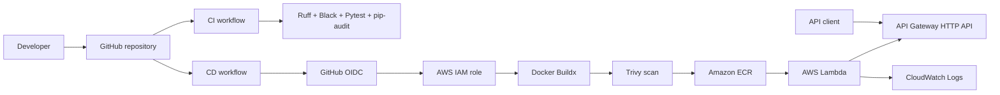
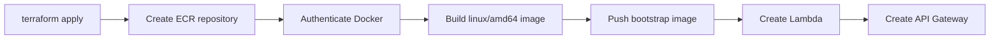

# Fuel Consumption Calculator

[](https://github.com/rajskirajski/fuel-consumption-calculator/actions/workflows/ci.yml)
[](https://github.com/rajskirajski/fuel-consumption-calculator/actions/workflows/cd.yml)
[](https://github.com/rajskirajski/fuel-consumption-calculator/actions/workflows/terraform.yml)

A serverless DevOps project that deploys a containerized **FastAPI** application to **AWS Lambda** using **Docker**, **Terraform** and **GitHub Actions**.

The API calculates vehicle fuel consumption in litres per 100 kilometres and, when a fuel price is provided, the total fuel cost of the trip.


---

## Project goals

The project demonstrates:

- containerized Python API development,
- Infrastructure as Code with modular Terraform,
- AWS Lambda deployment using container images,
- automated CI/CD with GitHub Actions,
- secure AWS authentication through GitHub OIDC,
- automated dependency and container security scanning,
- smoke testing after deployment,
- complete infrastructure cleanup and recreation.

---

## Architecture



### Initial deployment bootstrap

AWS Lambda requires the container image to exist in ECR before the function can be created. The Terraform configuration solves this automatically:



The bootstrap is implemented with `terraform_data` and `local-exec`. After `terraform destroy`, the next `terraform apply` recreates ECR, rebuilds and pushes the image, and then creates Lambda and API Gateway.

---

## Technology stack

| Area | Technology |
| --- | --- |
| Application | Python 3.12, FastAPI |
| Lambda adapter | Mangum |
| Validation and settings | Pydantic, pydantic-settings |
| Containerization | Docker, Docker Buildx |
| Compute | AWS Lambda — container image |
| API | Amazon API Gateway HTTP API |
| Registry | Amazon ECR |
| Logs | Amazon CloudWatch Logs |
| Infrastructure as Code | Terraform |
| CI/CD | GitHub Actions |
| AWS authentication | GitHub OIDC and IAM |
| Tests and quality | Pytest, Ruff, Black |
| Security | Trivy, pip-audit, Checkov |
| Dependency updates | Dependabot |

---

## API endpoints

| Method | Path | Description |
| --- | --- | --- |
| `GET` | `/health` | Application health check |
| `GET` | `/version` | Application name, version and environment |
| `POST` | `/kalkulatorspalania` | Fuel consumption and trip cost calculation |
| `GET` | `/docs` | Swagger UI |
| `GET` | `/redoc` | ReDoc documentation |
| `GET` | `/openapi.json` | OpenAPI schema |

### Example request

```bash
curl -X POST "$API_ENDPOINT/kalkulatorspalania" \
  -H "Content-Type: application/json" \
  -d '{
    "distance_km": 500,
    "fuel_used_liters": 40,
    "fuel_price": 6.5
  }'
```

### Example response

```json
{
  "fuel_consumption": 8.0,
  "total_cost": 260.0
}
```

The `fuel_price` field is optional. When it is omitted, the API calculates fuel consumption and returns `null` for `total_cost`.

---

## Repository structure

```text
fuel-consumption-calculator/
├── .github/
│   ├── dependabot.yml
│   └── workflows/
│       ├── ci.yml
│       ├── cd.yml
│       └── terraform.yml
├── app/
│   ├── calculator.py
│   ├── config.py
│   ├── main.py
│   └── schemas.py
├── docs/
│   ├── images/
│   └── additional project documentation
├── scripts/
│   ├── cleanup-local.sh
│   └── smoke-test.sh
├── terraform/
│   ├── modules/
│   │   ├── apigateway/
│   │   ├── cloudwatch/
│   │   ├── ecr/
│   │   ├── iam/
│   │   ├── lambda/
│   │   └── oidc/
│   ├── bootstrap.tf
│   ├── main.tf
│   ├── outputs.tf
│   ├── providers.tf
│   ├── variables.tf
│   └── terraform.tfvars.example
├── tests/
│   ├── test_calculator.py
│   ├── test_health.py
│   └── test_validation.py
├── Dockerfile
├── docker-compose.yml
├── Makefile
├── pyproject.toml
├── requirements.txt
└── requirements-dev.txt
```

---

## Prerequisites

Before running the project, install and configure:

- Python 3.12 or newer,
- Docker Desktop with a working Linux container engine,
- Terraform,
- AWS CLI authenticated to the target AWS account,
- Git.

The Terraform bootstrap runs Docker and AWS CLI commands locally, so both tools must be available when `terraform apply` is executed.

---

## Local development

Clone the repository:

```bash
git clone https://github.com/rajskirajski/fuel-consumption-calculator.git
cd fuel-consumption-calculator
```

Create and activate a virtual environment:

```bash
python3 -m venv .venv
source .venv/bin/activate
```

Install dependencies:

```bash
python -m pip install --upgrade pip
pip install -r requirements.txt -r requirements-dev.txt
```

Run the automated checks:

```bash
pytest -q
ruff check app tests
black --check app tests
pip-audit -r requirements.txt
```

Start the application:

```bash
uvicorn app.main:app --reload
```

Local addresses:

```text
Application: http://127.0.0.1:8000
Swagger UI:  http://127.0.0.1:8000/docs
OpenAPI:     http://127.0.0.1:8000/openapi.json
```

### Manual local verification

```bash
curl http://127.0.0.1:8000/health
```

```bash
curl http://127.0.0.1:8000/version
```

```bash
curl -X POST http://127.0.0.1:8000/kalkulatorspalania \
  -H "Content-Type: application/json" \
  -d '{"distance_km":500,"fuel_used_liters":40,"fuel_price":6.5}'
```

---

## Local Docker verification

Build the Lambda-compatible image:

```bash
docker buildx build \
  --platform linux/amd64 \
  --provenance=false \
  --load \
  -t fuel-consumption-calculator:local .
```

Run the container:

```bash
docker run --rm -p 9000:8080 fuel-consumption-calculator:local
```

The container exposes the AWS Lambda Runtime Interface Emulator on port `9000`.

The repository also contains a Docker Compose configuration:

```bash
docker compose up --build
```

Convenience commands are available in the `Makefile`, including:

```bash
make install-dev
make test
make lint
make run
make docker-build
make docker-run
```

---

## AWS deployment with Terraform

Create a local variables file:

```bash
cd terraform
cp terraform.tfvars.example terraform.tfvars
```

Set the correct values and ensure the application stack is enabled:

```hcl
project_name      = "fuel-consumption-calculator"
aws_region        = "eu-central-1"
aws_account_id    = "<AWS_ACCOUNT_ID>"
github_owner      = "<GITHUB_USERNAME>"
github_repository = "fuel-consumption-calculator"

enable_app_stack = true
image_tag         = "bootstrap"
```

The real `terraform.tfvars` file is ignored by Git and must not be committed.

Initialize and validate Terraform:

```bash
terraform init
terraform fmt -check -recursive
terraform validate
```

Review the plan:

```bash
terraform plan
```

Deploy:

```bash
terraform apply
```

A successful deployment returns:

- `api_endpoint`,
- `ecr_repository_url`,
- `github_actions_role_arn`,
- `lambda_function_name`.

### Verify the deployed API

```bash
curl "$(terraform output -raw api_endpoint)/health"
```

```bash
curl "$(terraform output -raw api_endpoint)/version"
```

```bash
curl -X POST "$(terraform output -raw api_endpoint)/kalkulatorspalania" \
  -H "Content-Type: application/json" \
  -d '{"distance_km":500,"fuel_used_liters":40,"fuel_price":6.5}'
```

Expected calculator response:

```json
{
  "fuel_consumption": 8.0,
  "total_cost": 260.0
}
```

---

## CI/CD

### Continuous Integration

The CI workflow runs on pull requests and pushes to `main`. It performs:

- dependency installation,
- Ruff linting,
- Black formatting verification,
- Pytest,
- `pip-audit` dependency scanning.

`pip-audit` is currently configured as informational and does not block the workflow.

### Terraform validation

The Terraform workflow runs for Terraform-related pull requests and can also be started manually. It performs:

- `terraform fmt -check -recursive`,
- `terraform init -backend=false`,
- `terraform validate`,
- Checkov scanning.

Checkov is currently configured as informational and does not block the workflow.

### Continuous Deployment

The CD workflow runs after a push to `main` or through manual dispatch:

1. authenticate to AWS using GitHub OIDC,
2. configure Docker Buildx,
3. build a `linux/amd64` Lambda-compatible image,
4. tag the image with the Git commit SHA and `latest`,
5. scan the local image with Trivy,
6. stop deployment on fixed `HIGH` or `CRITICAL` vulnerabilities,
7. push both tags to ECR,
8. update the Lambda function,
9. wait for the update,
10. call `/health` as a smoke test.


---

## Security

Security-related project decisions include:

- GitHub OIDC instead of long-lived AWS access keys,
- a dedicated GitHub Actions IAM role,
- an OIDC trust policy restricted to this repository,
- ECR scan-on-push,
- Trivy scanning before image deployment,
- `pip-audit` in CI,
- Checkov for Terraform,
- Dependabot for pip, Docker and GitHub Actions,
- ignored `.env`, `*.tfvars`, Terraform state and editor files,
- CloudWatch log retention configured through Terraform.

---

## Screenshots

### Terraform and AWS infrastructure


### API documentation and verification


---

## Cleanup and cost control

This project is intended to be deployed for development, testing or presentation and removed afterwards.

Destroy all Terraform-managed AWS resources:

```bash
cd terraform
terraform destroy
```

The ECR repository is configured so it can be deleted together with stored images. After destruction, another `terraform apply` automatically recreates the repository, rebuilds and pushes the bootstrap image, and restores the application stack.


Optional local cleanup:

```bash
cd ..
./scripts/cleanup-local.sh
```

---

## Author

**Przemysław Rajski**

GitHub: [rajskirajski](https://github.com/rajskirajski)

---

This repository was created for educational and portfolio purposes.
