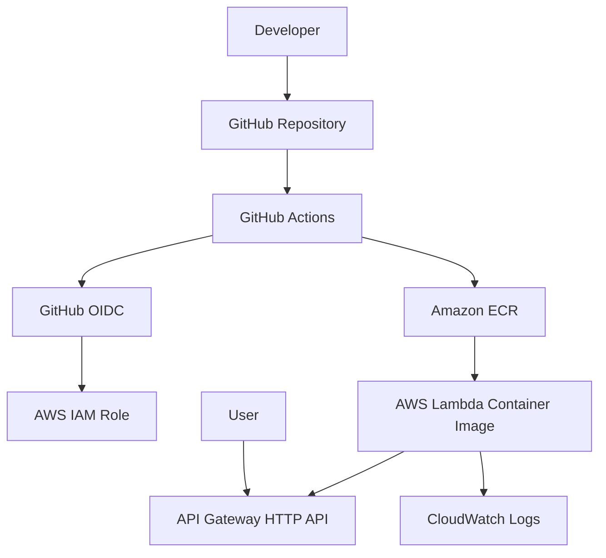

# Fuel Consumption Calculator


A simple FastAPI application deployed to AWS as a Lambda container image.  
The project demonstrates a practical CI/CD pipeline with Docker, Terraform, GitHub Actions and AWS OIDC authentication.

## Architecture



## Stack

- Python 3.12
- FastAPI
- Mangum
- Docker
- AWS Lambda Container Image
- Amazon ECR
- API Gateway HTTP API
- CloudWatch Logs
- Terraform
- GitHub Actions
- GitHub OIDC

## API endpoints

| Method | Path | Description |
| --- | --- | --- |
| GET | `/health` | Health check |
| GET | `/version` | App version |
| POST | `/kalkulatorspalania` | Fuel consumption calculator |
| GET | `/docs` | Swagger UI |

Example request:

```bash
curl -X POST http://localhost:8000/kalkulatorspalania \
  -H "Content-Type: application/json" \
  -d '{"distance_km":500,"fuel_used_liters":40,"fuel_price":6.5}'
```

Example response:

```json
{
  "fuel_consumption": 8.0,
  "total_cost": 260.0
}
```

## Local development

```bash
python -m venv .venv
source .venv/bin/activate
make install-dev
make run
```

Swagger UI:

```text
http://127.0.0.1:8000/docs
```

## Tests and lint

```bash
make test
make lint
```

## Docker Lambda local run

```bash
make docker-build
make docker-run
```

In another terminal:

```bash
make lambda-health
```

## AWS deployment

### 1. Configure AWS CLI

```bash
aws configure
```

Use:

```text
Region: eu-central-1
Account: 207909166461
```

### 2. Bootstrap Terraform

Lambda container images require an image to already exist in ECR.  
Therefore deployment is intentionally split into a safe bootstrap flow.

```bash
cd terraform
cp terraform.tfvars.example terraform.tfvars
terraform init
terraform apply
```

This creates:

- ECR
- GitHub OIDC provider
- IAM roles and policies

### 3. Push bootstrap image

From repository root:

```bash
chmod +x scripts/bootstrap-image.sh
./scripts/bootstrap-image.sh
```

### 4. Enable Lambda and API Gateway

Edit:

```text
terraform/terraform.tfvars
```

Set:

```hcl
enable_app_stack = true
image_tag = "bootstrap"
```

Then:

```bash
cd terraform
terraform apply
```

Terraform will output:

```text
api_endpoint
github_actions_role_arn
```

### 5. Push to GitHub

```bash
git init
git add .
git commit -m "Initial commit"
git branch -M main
git remote add origin git@github.com:rajskirajski/fuel-consumption-calculator.git
git push -u origin main
```

After this, GitHub Actions CD will:

1. Build Docker image.
2. Push it to ECR with `latest` and commit SHA tags.
3. Update Lambda.
4. Run smoke test on `/health`.

## Repository configuration

No static AWS access keys are needed.

GitHub Actions uses:

```text
arn:aws:iam::207909166461:role/fuel-consumption-calculator-github-actions-role
```

via OIDC.

## Important note about Terraform state

This project uses local Terraform state by default for simplicity.  
For team/production use, migrate state to S3 + DynamoDB locking.
