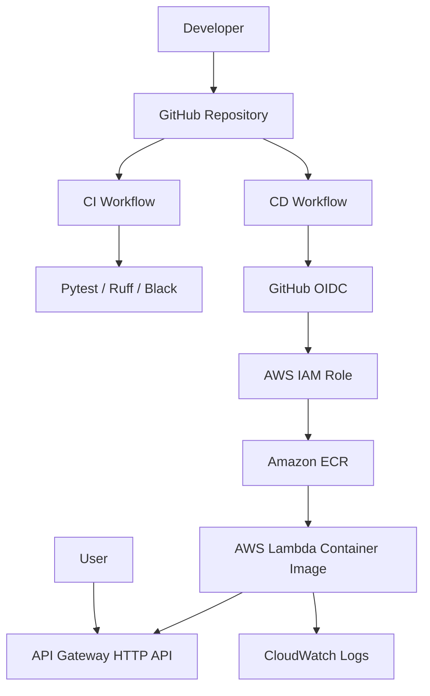

# Fuel Consumption Calculator


A complete DevOps portfolio project: a Python FastAPI application deployed to AWS Lambda as a container image, with infrastructure managed by Terraform and CI/CD handled by GitHub Actions.

The application calculates vehicle fuel consumption and optional trip fuel cost.

---

## Project goals

This repository demonstrates:

- containerized Python API development,
- Infrastructure as Code with Terraform,
- AWS Lambda deployment using container images,
- CI/CD automation with GitHub Actions,
- secure AWS authentication with GitHub OIDC,
- smoke testing after deployment,
- clean bootstrap and cleanup procedures.

---

## Architecture



---

## Tech stack

| Area | Technology |
| --- | --- |
| Application | Python 3.12, FastAPI |
| Lambda adapter | Mangum |
| Container | Docker |
| Registry | Amazon ECR |
| Compute | AWS Lambda Container Image |
| API | API Gateway HTTP API |
| Logs | CloudWatch Logs |
| IaC | Terraform |
| CI/CD | GitHub Actions |
| Auth | GitHub OIDC to AWS IAM |

---

## API endpoints

| Method | Path | Description |
| --- | --- | --- |
| GET | `/health` | Health check |
| GET | `/version` | Application version |
| POST | `/kalkulatorspalania` | Fuel consumption calculator |
| GET | `/docs` | Swagger UI |
| GET | `/openapi.json` | OpenAPI schema |

Example request:

```bash
curl -X POST "$API_ENDPOINT/kalkulatorspalania" \
  -H "Content-Type: application/json" \
  -d '{"distance_km":500,"fuel_used_liters":40,"fuel_price":6.5}'
```

Example response:

```json
{
  "fuel_consumption": 8.0,
  "total_cost": 260.0
}
```

---

## Local development

```bash
python3 -m venv .venv
source .venv/bin/activate
pip install --upgrade pip
pip install -r requirements.txt -r requirements-dev.txt
pytest -q
uvicorn app.main:app --reload
```

Swagger UI:

```text
http://127.0.0.1:8000/docs
```

---

## Deployment overview

Deployment is split into a safe bootstrap flow because AWS Lambda requires the container image to exist in ECR before the Lambda function can be created.

Full guide:

```text
docs/bootstrap.md
```

Short version:

```bash
cd terraform
cp terraform.tfvars.example terraform.tfvars
terraform init
terraform apply
```

Then push bootstrap image:

```bash
cd ..
chmod +x scripts/bootstrap-image.sh
./scripts/bootstrap-image.sh
```

Enable application stack:

```hcl
enable_app_stack = true
image_tag = "bootstrap"
```

Apply again:

```bash
cd terraform
terraform apply
```

After this, GitHub Actions CD can deploy every push to `main`.

---

## CI/CD

### CI workflow

Runs on pull requests and pushes to `main`.

Checks:

- Ruff
- Black
- Pytest

### Terraform workflow

Checks:

- `terraform fmt -check -recursive`
- `terraform init -backend=false`
- `terraform validate`

### CD workflow

Runs on push to `main`.

Steps:

1. Authenticate to AWS with GitHub OIDC.
2. Build Lambda-compatible Docker image.
3. Push image to ECR with commit SHA and `latest`.
4. Update Lambda function.
5. Run smoke test on `/health`.

---

## Screenshots

Add your screenshots here after deployment:

| Screenshot | Path |
| --- | --- |
| Green GitHub Actions CI/CD/Terraform | `docs/images/github-actions-success.png` |
| AWS Lambda function | `docs/images/aws-lambda.png` |
| API Gateway endpoint | `docs/images/api-gateway.png` |
| Swagger UI from AWS URL | `docs/images/swagger-aws.png` |
| CloudWatch logs | `docs/images/cloudwatch-logs.png` |

See:

```text
docs/screenshots.md
```

---

## Estimated AWS costs

This project is designed to stay very cheap for learning and portfolio use.

Typical resources:

- AWS Lambda
- API Gateway HTTP API
- ECR storage
- CloudWatch Logs

For very low traffic, the monthly cost should usually be close to zero or a few PLN/EUR, depending on usage and log retention.

More details:

```text
docs/costs.md
```

---

## Cleanup

To remove AWS resources:

```bash
cd terraform
terraform destroy
```

Optional local cleanup:

```bash
chmod +x scripts/cleanup-local.sh
./scripts/cleanup-local.sh
```

More details:

```text
docs/cleanup.md
```

---

## Security notes

- No long-lived AWS keys are stored in GitHub.
- GitHub Actions authenticate to AWS using OIDC.
- IAM role trust policy is limited to this repository and branch.
- Lambda permissions are scoped to API Gateway integration.

---

## Repository

```text
https://github.com/rajskirajski/fuel-consumption-calculator
```
