# Fuel Consumption Calculator

[](https://github.com/rajskirajski/fuel-consumption-calculator/actions/workflows/ci.yml)
[](https://github.com/rajskirajski/fuel-consumption-calculator/actions/workflows/cd.yml)
[](https://github.com/rajskirajski/fuel-consumption-calculator/actions/workflows/terraform.yml)

A complete cloud-native **Serverless DevOps** project demonstrating deployment of a containerized **FastAPI** application to **AWS Lambda** using **Terraform**, **Docker**, **GitHub Actions**, **Amazon ECR**, **Amazon API Gateway**, **CloudWatch**, **OIDC authentication**, **Trivy security scanning**, and **Dependabot**.

The application calculates vehicle fuel consumption and trip fuel cost while showcasing a production-style Infrastructure as Code workflow with automated CI/CD pipelines and modern cloud deployment practices.

---

# Project Overview

This project demonstrates the deployment of a Python FastAPI application into a fully serverless AWS environment.

Instead of using traditional virtual machines or Kubernetes, the application runs as a Docker Container Image inside AWS Lambda.

Infrastructure provisioning, deployment, security validation and application updates are fully automated.

The repository demonstrates:

- Infrastructure as Code
- Container-based serverless deployment
- Continuous Integration
- Continuous Deployment
- Security Scanning
- Automated Dependency Updates
- Modern AWS Authentication using GitHub OIDC
---

## Features

- FastAPI REST API
- AWS Lambda Container Images
- Amazon API Gateway HTTP API
- Amazon Elastic Container Registry (ECR)
- Amazon CloudWatch Logs
- Terraform Infrastructure as Code
- Modular Terraform Architecture
- GitHub Actions CI
- GitHub Actions CD
- GitHub OpenID Connect Authentication
- Docker Buildx
- Ruff Static Analysis
- Black Code Formatting
- Pytest Automated Tests
- Trivy Container Security Scanning
- Dependabot Dependency Updates
- Swagger UI
- OpenAPI Documentation
- Fully Automated Infrastructure Deployment
- Automatic Docker Bootstrap
- Complete Infrastructure Recreation using Terraform

---

# Architecture

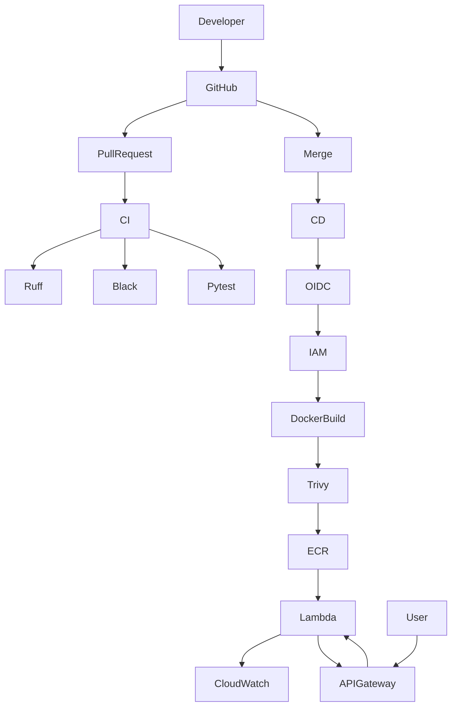

---

# Deployment Flow

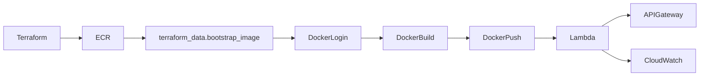

---

# Technology Stack

| Area | Technology |
|------|------------|
| Language | Python 3.12 |
| Framework | FastAPI |
| ASGI Adapter | Mangum |
| Container | Docker |
| Infrastructure | Terraform |
| Cloud | AWS |
| Compute | AWS Lambda |
| Registry | Amazon ECR |
| API | API Gateway HTTP API |
| Monitoring | Amazon CloudWatch |
| CI/CD | GitHub Actions |
| Authentication | GitHub OIDC |
| Linting | Ruff |
| Formatting | Black |
| Testing | Pytest |
| Security | Trivy |
| Dependency Updates | Dependabot |

---

# Repository Structure

```text
fuel-consumption-calculator
│
├── app/
├── docs/
│   └── images/
├── scripts/
├── terraform/
│   └── modules/
├── tests/
├── .github/
│   ├── workflows/
│   └── dependabot.yml
│
├── Dockerfile
├── docker-compose.yml
├── Makefile
├── pyproject.toml
├── requirements.txt
├── requirements-dev.txt
├── README.md
└── LICENSE
```

---

# Directory Description

## app/

Contains the FastAPI application source code.

Responsible for:

- REST API
- Business Logic
- Validation Models
- Configuration

---

## terraform/

Contains complete Infrastructure as Code.

Infrastructure is divided into reusable modules.

Provisioned resources include:

- Amazon ECR
- AWS Lambda
- API Gateway
- CloudWatch
- IAM
- GitHub OIDC

---

## tests/

Contains automated unit and integration tests.

Executed automatically by GitHub Actions.

---

## .github/workflows/

Contains GitHub Actions workflows responsible for Continuous Integration, Continuous Deployment and Terraform validation.

---

## docs/

Contains project documentation and screenshots used inside this README.

---

## scripts/

Utility scripts supporting local development and smoke testing.

---
# Local Development

## Clone Repository

```bash
git clone https://github.com/rajskirajski/fuel-consumption-calculator.git

cd fuel-consumption-calculator
```

---

## Create Python Virtual Environment

Linux / macOS

```bash
python3 -m venv .venv

source .venv/bin/activate
```

Windows PowerShell

```powershell
python -m venv .venv

.venv\Scripts\Activate.ps1
```

---

## Install Dependencies

```bash
pip install --upgrade pip

pip install -r requirements.txt

pip install -r requirements-dev.txt
```

---

## Start FastAPI

```bash
uvicorn app.main:app --reload
```

Application:

```text
http://127.0.0.1:8000
```

Swagger:

```text
http://127.0.0.1:8000/docs
```

OpenAPI Specification

```text
http://127.0.0.1:8000/openapi.json
```

---

# Docker

## Build Local Image

```bash
docker build \
--platform linux/amd64 \
--provenance=false \
-t fuel-consumption-calculator:local .
```

---

## Run Container

```bash
docker run --rm -p 9000:8080 fuel-consumption-calculator:local
```

Lambda Runtime Interface Emulator becomes available on:

```text
http://localhost:9000
```

---

## Docker Compose

```bash
docker compose up --build
```

---

# Terraform

## Prerequisites

Before deployment make sure the following software is installed:

- Docker Desktop
- Terraform
- AWS CLI
- Git
- Python 3.12+

---

## Configure Variables

Copy:

```bash
cd terraform

cp terraform.tfvars.example terraform.tfvars
```

Edit:

```hcl
aws_region        = "eu-central-1"

aws_account_id    = "<AWS_ACCOUNT_ID>"

project_name      = "fuel-consumption-calculator"

github_owner      = "<YOUR_GITHUB_USERNAME>"

github_repository = "fuel-consumption-calculator"

enable_app_stack = true

image_tag = "bootstrap"
```

---

## Initialize Terraform

```bash
terraform init
```

---

## Validate Configuration

```bash
terraform fmt -recursive

terraform validate
```

---

## Preview Changes

```bash
terraform plan
```

---

## Deploy Infrastructure

```bash
terraform apply
```

---

# Automatic Bootstrap Process

AWS Lambda Container Images require an image to exist inside Amazon ECR before Lambda can be created.

To eliminate manual deployment steps, this repository performs the bootstrap process automatically.

Terraform executes the following sequence:

1. Create Amazon ECR Repository

2. Authenticate Docker to Amazon ECR

3. Build Docker Image

4. Push Bootstrap Image

5. Create AWS Lambda

6. Create API Gateway

7. Create CloudWatch Log Group

No manual Docker commands are required.

---

# Infrastructure Recreation

One of the project goals was complete infrastructure recreation.

The following command removes all cloud resources:

```bash
terraform destroy
```

Later, infrastructure can be recreated simply by running:

```bash
terraform apply
```

Terraform automatically rebuilds and uploads the Docker image before creating Lambda again.

---

# Terraform Outputs

Successful deployment returns outputs similar to:

```text
api_endpoint

ecr_repository_url

lambda_function_name

github_actions_role_arn
```

Example:

```bash
terraform output
```

---

# Continuous Integration

Every Pull Request automatically executes:

- Ruff

- Black

- Pytest

Only validated code can be merged into the main branch.

---

# Continuous Deployment

Every push to the **main** branch automatically performs:

1. GitHub OIDC Authentication

2. Configure AWS Credentials

3. Docker Buildx Build

4. Trivy Security Scan

5. Push Docker Image to Amazon ECR

6. Update AWS Lambda

7. Smoke Test

Deployment is completely automated.

---

# GitHub Actions Workflows

## CI

File:

```text
.github/workflows/ci.yml
```

Responsibilities:

- Install dependencies

- Ruff

- Black

- Pytest

---

## CD

File:

```text
.github/workflows/cd.yml
```

Responsibilities:

- Configure AWS Credentials

- Docker Buildx

- Trivy Security Scan

- Docker Push

- Lambda Update

- Smoke Test

---

## Terraform

File:

```text
.github/workflows/terraform.yml
```

Responsibilities:

- terraform fmt

- terraform init

- terraform validate

---

# Security

## GitHub OpenID Connect

The deployment pipeline authenticates using GitHub OIDC.

No long-lived AWS Access Keys are stored inside GitHub Secrets.

---

## IAM

Least privilege permissions are applied.

GitHub Actions uses a dedicated IAM Role.

---

## Container Security

Every Docker image is scanned using Trivy before deployment.

Deployments automatically stop when HIGH or CRITICAL vulnerabilities are detected.

---

## Dependency Management

Dependabot automatically creates Pull Requests whenever dependency updates become available.

Protected dependencies include:

- Python packages

- GitHub Actions

- Docker base images

---
# API

Base URL

```text
https://<api-id>.execute-api.eu-central-1.amazonaws.com
```

---

## Health Check

Checks whether the application is running.

### Request

```http
GET /health
```

### Example

```bash
curl https://<api-endpoint>/health
```

### Response

```json
{
  "status": "healthy"
}
```

---

## Version

Returns the current application version.

### Request

```http
GET /version
```

### Example

```bash
curl https://<api-endpoint>/version
```

### Response

```json
{
  "version": "1.0.0"
}
```

---

## Fuel Consumption Calculator

Calculates:

- Fuel consumption (L/100 km)
- Total fuel cost

### Request

```http
POST /kalkulatorspalania
```

### Request Body

```json
{
    "distance_km":500,
    "fuel_used_liters":40,
    "fuel_price":6.5
}
```

### Example

```bash
curl -X POST https://<api-endpoint>/kalkulatorspalania \
-H "Content-Type: application/json" \
-d '{
      "distance_km":500,
      "fuel_used_liters":40,
      "fuel_price":6.5
    }'
```

### Response

```json
{
    "fuel_consumption":8.0,
    "total_cost":260.0
}
```

---

# Manual Verification

The project was manually verified on three different levels.

- Local application
- Docker container
- AWS deployment

---

# Local Tests

## Pytest

```bash
pytest -q
```

Expected result:

```text
All tests passed
```

---

## Ruff

```bash
ruff check app tests
```

Expected:

```text
All checks passed
```

---

## Black

```bash
black --check app tests
```

Expected:

```text
would reformat: 0 files
```

---

## Start FastAPI

```bash
uvicorn app.main:app --reload
```

Open

```text
http://127.0.0.1:8000/docs
```

---

## Test Health Endpoint

```bash
curl http://127.0.0.1:8000/health
```

Expected response

```json
{
    "status":"healthy"
}
```

---

## Test Calculator Endpoint

```bash
curl -X POST http://127.0.0.1:8000/kalkulatorspalania \
-H "Content-Type: application/json" \
-d '{"distance_km":500,"fuel_used_liters":40,"fuel_price":6.5}'
```

Expected response

```json
{
    "fuel_consumption":8.0,
    "total_cost":260.0
}
```

---

# Docker Verification

## Build

```bash
docker build \
--platform linux/amd64 \
--provenance=false \
-t fuel-consumption-calculator:local .
```

---

## Run

```bash
docker run --rm -p 9000:8080 fuel-consumption-calculator:local
```

Verify that Lambda Runtime Interface Emulator starts successfully.

---

# Terraform Verification

```bash
terraform fmt -recursive
```

```bash
terraform validate
```

```bash
terraform plan
```

Expected:

```text
No validation errors
```

---

# AWS Verification

Deploy infrastructure

```bash
terraform apply
```

---

## Health Endpoint

```bash
curl "$(terraform output -raw api_endpoint)/health"
```

Expected

```json
{
    "status":"healthy"
}
```

---

## Calculator Endpoint

```bash
curl -X POST "$(terraform output -raw api_endpoint)/kalkulatorspalania" \
-H "Content-Type: application/json" \
-d '{"distance_km":500,"fuel_used_liters":40,"fuel_price":6.5}'
```

Expected

```json
{
    "fuel_consumption":8.0,
    "total_cost":260.0
}
```

---

## CloudWatch

Verify that Lambda execution logs appear inside:

```text
CloudWatch

↓

Log Groups

↓

fuel-consumption-calculator
```

---

# Infrastructure Cleanup

To avoid unnecessary AWS charges execute:

```bash
terraform destroy
```

Infrastructure can later be recreated using:

```bash
terraform apply
```

without performing any manual Docker or Amazon ECR operations.

---

# Project Screenshots

The screenshots below were created during development and deployment of the project.

## Repository

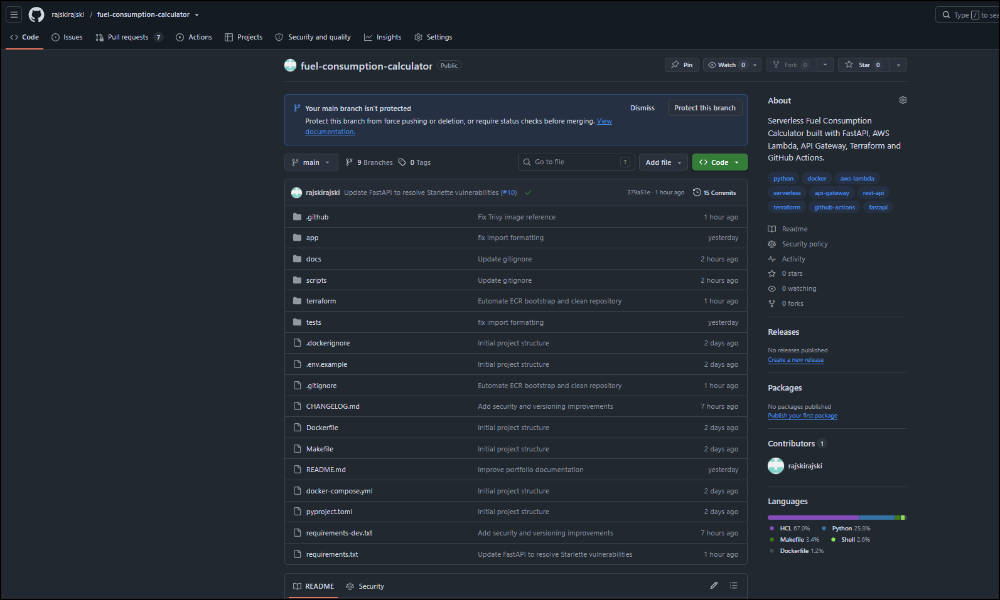

---

## GitHub Actions CI

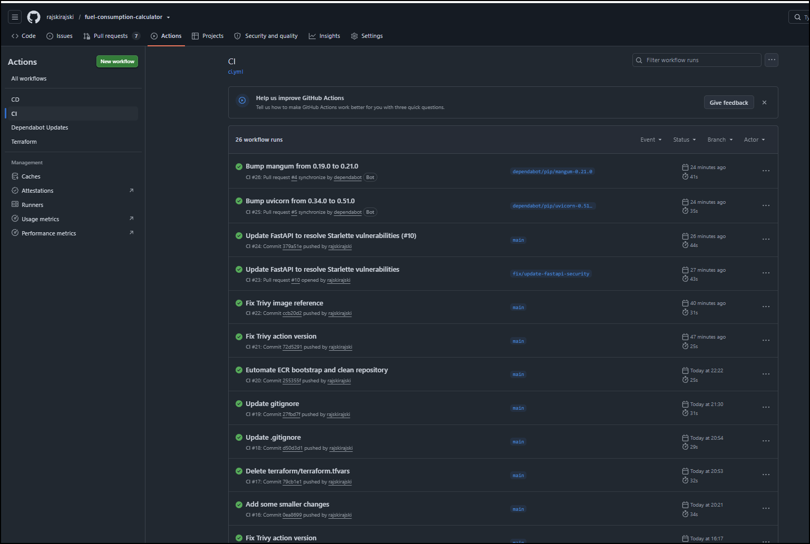

---

## GitHub Actions CD

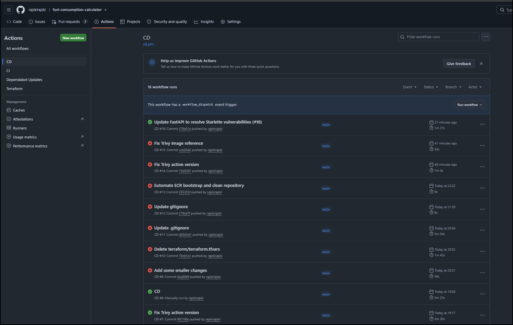

---

## Dependabot

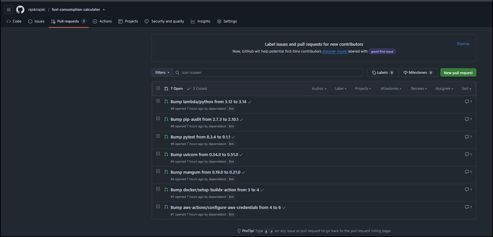

---

## Terraform Apply

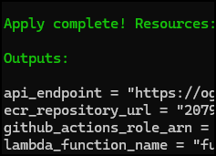

---

## Amazon ECR

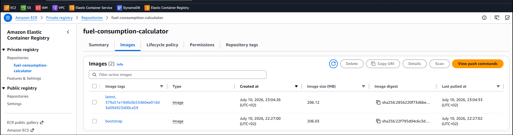

---

## AWS Lambda

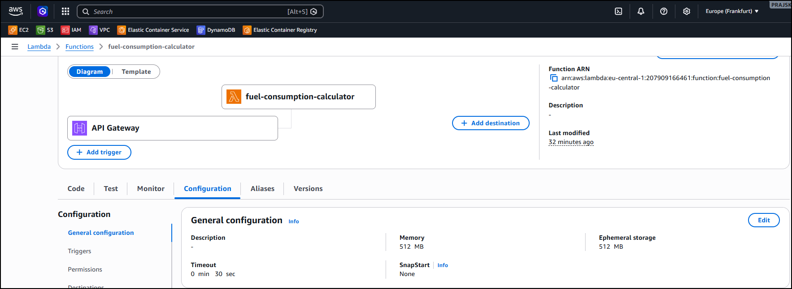

---

## API Gateway

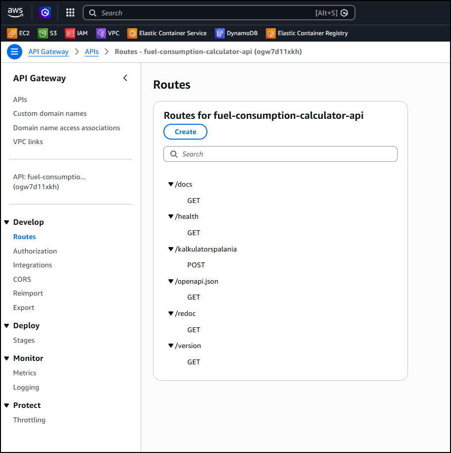

---

## CloudWatch

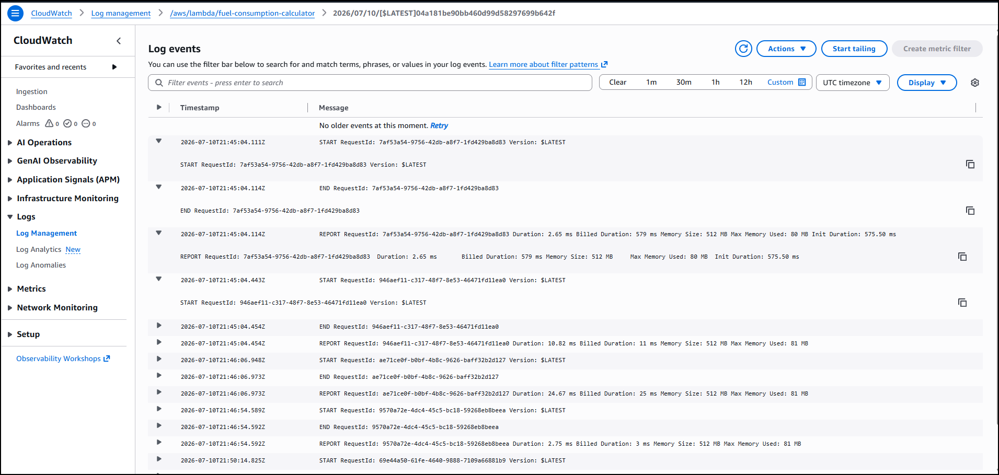

---

## Swagger UI

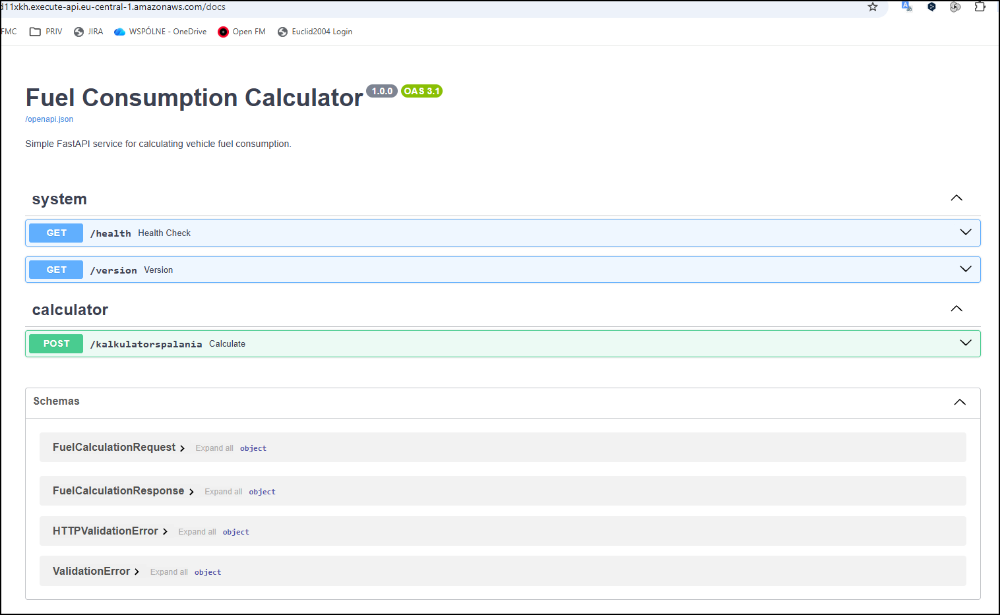
## Health Endpoint

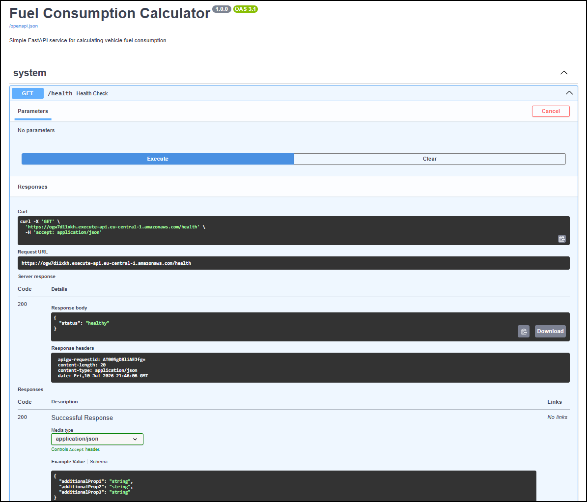

---

## Version Endpoint

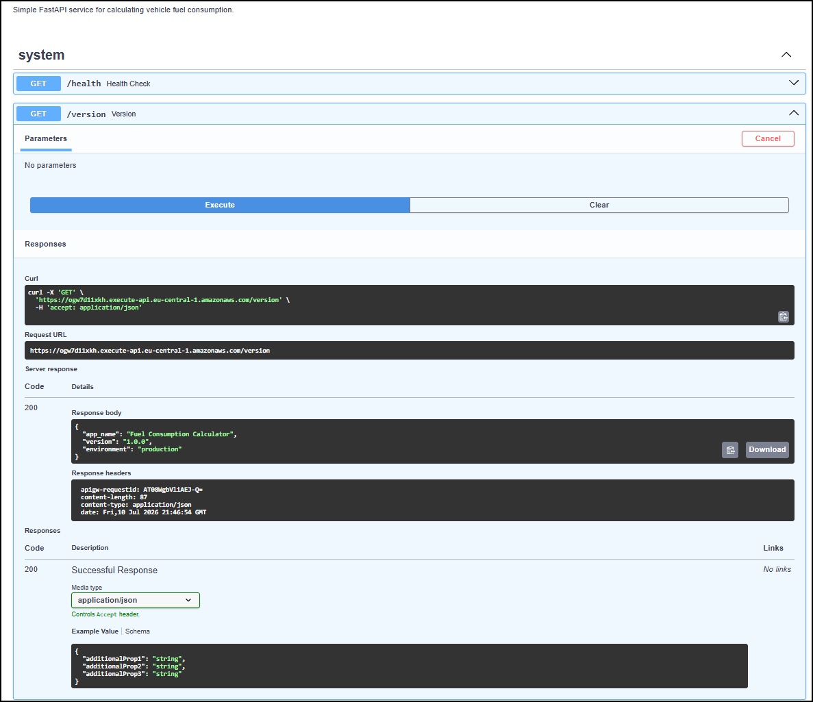

---

## Calculator Request

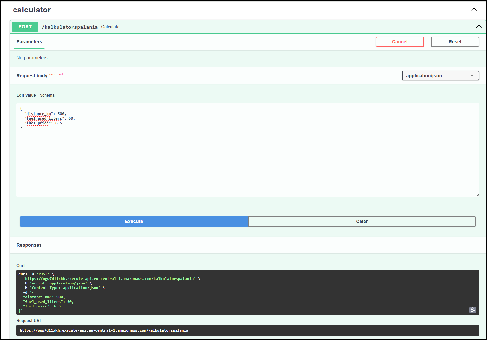

---

## Calculator Response

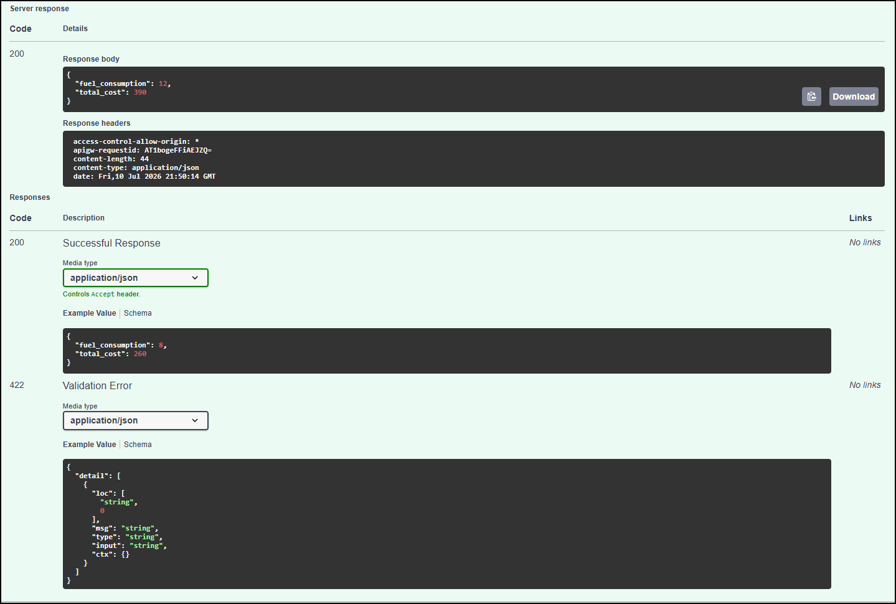

---

## Terraform Destroy

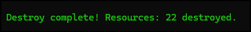

---

# Cost Optimisation

The project was designed to minimise AWS costs while still presenting a complete cloud-native deployment workflow.

The application uses serverless services, meaning compute resources are only consumed when requests are executed.

To completely remove the infrastructure and avoid unnecessary charges:

```bash
terraform destroy
```

The project supports full infrastructure recreation.

Running

```bash
terraform apply
```

automatically performs the following actions:

- Creates Amazon ECR
- Builds the Docker image
- Pushes the bootstrap image
- Creates AWS Lambda
- Creates API Gateway
- Creates CloudWatch Log Group

No manual Docker build or Docker push commands are required after infrastructure removal.

---

# Security

The repository follows modern DevOps security practices.

## GitHub OIDC

GitHub Actions authenticates to AWS using OpenID Connect.

Benefits:

- No long-lived AWS Access Keys
- Temporary credentials
- IAM Role assumption
- Reduced attack surface

---

## IAM

The deployment pipeline uses a dedicated IAM Role with least-privilege permissions.

---

## Trivy

Every Docker image is scanned before deployment.

Deployment automatically stops whenever HIGH or CRITICAL vulnerabilities are detected.

---

## Dependabot

Dependabot continuously monitors:

- Python dependencies
- Docker images
- GitHub Actions

and automatically creates Pull Requests when updates become available.

---

# AWS Services Used

| Service | Purpose |
|----------|---------|
| AWS Lambda | Application execution |
| Amazon API Gateway | REST API |
| Amazon ECR | Docker image registry |
| Amazon CloudWatch | Logs |
| IAM | Authentication & authorization |
| GitHub OIDC | Secure AWS authentication |

---

# Development Workflow

```text
Feature Branch
        │
        ▼
Pull Request
        │
        ▼
GitHub Actions CI
        │
        ├── Ruff
        ├── Black
        └── Pytest
        │
        ▼
Merge into main
        │
        ▼
GitHub Actions CD
        │
        ├── OIDC Authentication
        ├── Docker Build
        ├── Trivy Scan
        ├── Push to Amazon ECR
        ├── Update AWS Lambda
        └── Smoke Test
```

---

# Project Goals

The main objective of this project was to demonstrate a complete serverless deployment pipeline using modern DevOps practices.

The project includes:

- Infrastructure as Code
- Automated CI/CD
- Secure AWS authentication
- Automated testing
- Container image security scanning
- Dependency management
- Cloud-native deployment
- Infrastructure recreation using Terraform

---

# Learning Outcomes

During the implementation of this project the following technologies and concepts were used:

- Python
- FastAPI
- Docker
- Docker Buildx
- AWS Lambda
- Amazon API Gateway
- Amazon ECR
- Amazon CloudWatch
- Terraform
- GitHub Actions
- GitHub OIDC
- IAM Roles
- Trivy
- Ruff
- Black
- Pytest
- Dependabot

---

# License

This repository is provided for educational and portfolio purposes.

---

# Author

**Przemysław Rajski**

Medical Applications Administrator with a strong interest in Cloud, DevOps and Infrastructure as Code.

GitHub:

https://github.com/rajskirajski

---

## Acknowledgements

This project demonstrates practical usage of:

- FastAPI
- Docker
- Terraform
- AWS Lambda Container Images
- Amazon API Gateway
- GitHub Actions
- GitHub OpenID Connect
- Amazon CloudWatch
- Amazon Elastic Container Registry
- Trivy
- Dependabot

to build a complete cloud-native deployment pipeline.
